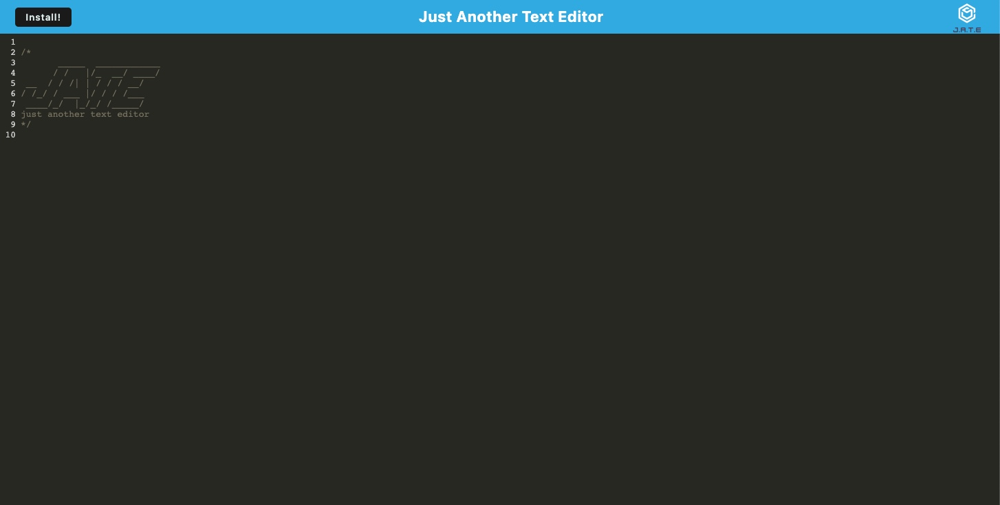

# Text Editor

## Description

This is a text editor that runs in the browser. The app will be a single-page application that meets the PWA criteria. Additionally, it will feature a number of data persistence techniques that serve as redundancy in case one of the options is not supported by the browser. The application will also function offline.

To build this text editor, you will start with an existing application and implement methods for getting and storing data to an IndexedDB database. This uses a package called `idb`, which is a lightweight wrapper around the IndexedDB API. It features a number of methods that are useful for storing and retrieving data, and is used by companies like Google and Mozilla.

## User Story

```md
AS A developer
I WANT to create notes or code snippets with or without an internet connection
SO THAT I can reliably retrieve them for later use
```

### Table of Contents

---

- [Installation](#installation)
- [Usage](#usage)
- [License](#license)
- [Contributing](#contributing)
- [Tests](#tests)
- [Questions](#questions)
- [Link to deployed application](#deployed-app)

## Installation

`npm init`

`npm install`

`npm run build`

To deploy this full-stack application to Heroku use the [Heroku Deployment Guide on The Full-Stack Blog](https://coding-boot-camp.github.io/full-stack/heroku/heroku-deployment-guide).

## Usage

to use the app on your local browser `npm start`

to open the app on heroku `heroku open`

---

### License: MIT

---

## Contributing

Please read the installation section. For the repository owner, contribution guidelines are a way to communicate how people should contribute. For contributors, the guidelines help them verify that they're submitting well-formed pull requests and opening useful issues. For both owners and contributors, contribution guidelines save time and hassle caused by improperly created pull requests or issues that have to be rejected and re-submitted.

---

### Tests: npm test

---

## Questions

If you have additional questions about this project please contact me directly at <crumwj22@hotmail.com>.
You can view more of my projects at <https://github.com/crumwj22>.

## Deployed App

<a href="https://text-editor-jessec.herokuapp.com/">Link to Just Another Text Editor App</a>


